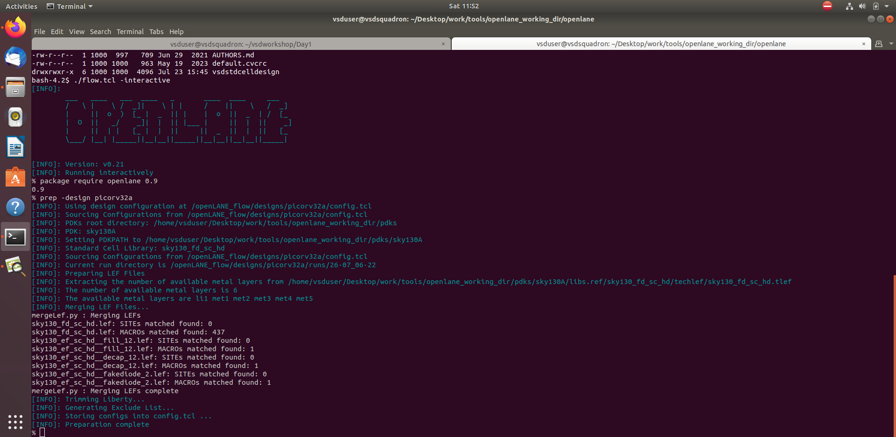

# 🗓️ Sky130 Day 1 – Inception of Open-Source EDA, OpenLANE and Sky130 PDK

---

## 🎯 Objective

- Understand how software applications become hardware using RTL to GDSII flow  
- Learn about SoC components: chips, dies, cores, pads, and IPs  
- Introduction to RISC-V and open-source EDA tools  
- Prepare and run synthesis in OpenLANE using Sky130  
- Characterize synthesized design using flop ratio  

---

## 📘 Theory Section

### 🔸 0. Introduction to QFN-48 Package, Chip, Pads, Core, Die, and IPs

- **Chip**: The actual silicon die that holds your digital logic  
- **Package (QFN-48)**: Holds and protects the chip; has 48 pins for connection  
- **Pads**: Metal terminals on the die used for bonding with package pins  
- **Core**: The active region of the die (excluding pads and IOs)  
- **IP Blocks**: Pre-designed logic like PLLs, memories, etc., reused across chips  

📷 Screenshot:  


📷 Screenshot:  


📷 Screenshot:  


---

### 🔸 1. Introduction to RISC-V

- **RISC-V** is an open-source Instruction Set Architecture (ISA)  
- Used widely in open-source and academic processor designs  
- Base ISA is simple, modular, and extensible  

📷 Screenshot:  


---

### 🔸 2. From Software Applications to Hardware

- Software is written in C, compiled to assembly (e.g., RISC-V), executed on hardware  
- Hardware implements ISA logic using digital circuits  
- VLSI engineers design the underlying digital hardware that executes software  

📷 Screenshot:  


📷 Screenshot:  
       

---

### 🔸 3. Open-Source Digital ASIC Design Components

| Component | Tool Used       | Role                        |
|-----------|------------------|-----------------------------|
| Synthesis | Yosys            | RTL to gate-level netlist  |
| Floorplan | OpenLANE scripts | Macro and IO placement     |
| Layout    | Magic            | View/edit physical layout  |
| Checks    | Netgen/Klayout   | DRC, LVS, PEX              |

📷 Screenshot:  


---

### 🔸 4. Simplified RTL2GDSII Flow

1. Write RTL (Verilog)  
2. Synthesis → Netlist  
3. Floorplan → Placement → CTS → Routing  
4. DRC + LVS  
5. Export GDSII for tapeout  

📷 Screenshot:  


---

### 🔸 5. OpenLANE Detailed ASIC Design Flow

- Each OpenLANE step has configurable TCL scripts  
- Fully open-source RTL to GDSII automation  
- Output logs for every stage are stored inside `/runs/<design-name>/`  

📷 Screenshot:  


---

### 🔸 6. sky130A PDK Directory Structure

Once OpenLANE is installed, the Platform Development Kit (PDK) for Sky130 is downloaded under the path:

`~/Desktop/work/tools/openlane_working_dir/pdks/sky130A/`

---

Run the following to explore the PDK structure:

```bash
cd ~/Desktop/work/tools/openlane_working_dir/pdks/sky130A/
ls -ltr
```

📂 Sample Output:
```
libs.tech/     # Technology-specific data: magic, ngspice, klayout, etc.
libs.ref/      # Reference libraries: standard cell libraries, IOs, macros
SOURCES        # Source info file for PDK installation
```

---

📘 Inside `libs.tech/` – Contains tools-related tech files

```bash
cd libs.tech
ls -ltr
```

📂 Output:
```
magic/       # For layout editing (used by Magic tool)
ngspice/     # For simulation models
netgen/      # For LVS checking
openlane/    # Tech data used by OpenLANE
klayout/     # For viewing layouts
irsim/       # For digital simulation
xschem/      # For schematic capture
xcircuit/    # Alternative schematic tool
qflow/       # Digital flow tool
```

---

📘 Inside `libs.ref/` – Contains standard cells, IOs, macros

```bash
cd ../libs.ref
ls -ltr
```

📂 Output:
```
sky130_fd_sc_hd/     # High Density standard cells
sky130_fd_sc_hs/     # High Speed standard cells
sky130_fd_sc_ms/     # Medium Speed standard cells
sky130_fd_sc_ls/     # Low Speed standard cells
sky130_fd_sc_lp/     # Low Power standard cells
sky130_fd_sc_hdll/   # High Density Low Leakage
sky130_fd_sc_hvl/    # High Voltage Libraries
sky130_fd_io/        # IO Cells
sky130_sram_macros/  # SRAM Macros
sky130_ml_xx_hd/     # Mixed-signal libraries
sky130_fd_pr/        # Primitive devices (transistors, resistors, etc.)
sky130_osu_sc_t18/   # OSU-based standard cells (for experimentation)
```

---

📷 Screenshot:  


---

## 🧪 Practical Section – Lab Steps for Synthesis

### 🔸 7. 🚀 OpenLANE Flow – Picorv32a Design (Sky130 PDK)

This section documents running the `picorv32a` design using OpenLANE v0.21 and Sky130A PDK. The flow includes preparing the interactive session, running the `prep` step, and checking output directories.

---

#### ✅ Step 1 – Launch Docker and Start OpenLANE Flow

```bash
cd ~/Desktop/work/tools/openlane_working_dir/openlane/
docker
```

Inside Docker shell:

```tcl
./flow.tcl -interactive
```

Then at `%` prompt:

```tcl
package require openlane 0.9
```

📷 Screenshot:  


---

#### ✅ Step 2 – Prepare the Picorv32a Design

Inside the interactive OpenLANE shell:

```tcl
prep -design picorv32a
```

This step:

- Loads configuration from `config.tcl`
- Initializes PDK and Standard Cells
- Merges LEF/Liberty files
- Final message: **Preparation complete**

📷 Screenshot:  


📷 Screenshot:  


---

#### ✅ Step 3 – Explore Design Run and Temporary Files

```bash
cd designs/picorv32a/runs/
cd 26-07_06-22/
cd tmp/
ls -ltr
```

You can now access all intermediate folders:

- `floorplan/`, `synthesis/`, `routing/`, etc.
- Files like `merged.lef`, `trimmed.lib`, `met_layers_list.txt`

📷 Screenshot:  


---

---

### 🔸 8. Run Synthesis + Review Files

```tcl
run_synthesis
```

📤 Output:
```
[INFO]: Number of cells: 14876
[INFO]: Number of DFF_X1 cells: 1613
[INFO]: Synthesis complete!
```

📷 Screenshot:  


Check the log file manually:

```bash
runs/vsdstdcelldesign/logs/synthesis/1-yosys_0.log
```

📷 Screenshot:  


---

### 🔸 9. Steps to Characterize Synthesis Results

Formula:

```
Flop Ratio = (Number of DFFs / Total Cells) * 100
           = (1613 / 14876) * 100 ≈ 10.84%
```

📷 Screenshot:  
  
📷 Screenshot:  


---

## ✅ Summary

| Step                       | Status | Notes                            |
|----------------------------|--------|----------------------------------|
| Theory + Chip Basics       | ✅     | QFN, RISC-V, RTL2GDSII explained |
| Tool Setup + Directory     | ✅     | Screenshot and structure shown   |
| Design Prep                | ✅     | `prep -design` complete          |
| Synthesis Run + Output     | ✅     | Logs + DFF count visible         |
| Flop Ratio Characterization| ✅     | 10.84% ratio calculated          |

---

