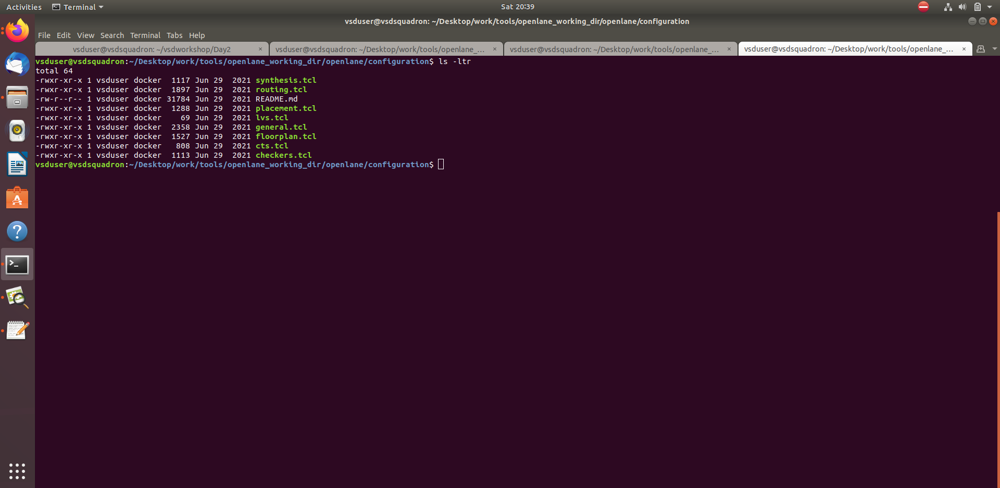
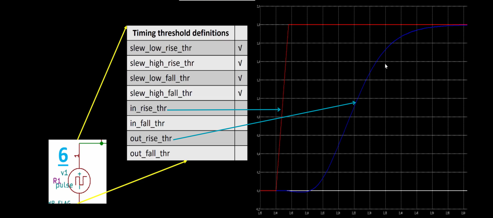

# Day 2: Good Floorplan vs Bad Floorplan and Introduction to Library Cells

## Chip Floor Planning Considerations

### 1. Utilization Factor and Aspect Ratio

```sh
Utilisation Factor =  Area occupied by netlist
                     --------------------------
                        Total area of core

Aspect Ratio = Height / Width
```

- If Utilization = 1, there's no space left for routing or buffers. Typically, we keep it around 0.5–0.6.
- Lower utilization allows space for routing wires and filler cells.

---

### 2. Concept of Pre-placed Cells

- Pre-placed cells (e.g., macros) must be fixed before automated placement.
- These cannot be moved by place and route tools.


---

### 3. Decoupling Capacitors

- High switching blocks may suffer from voltage drop due to wire resistance and inductance.
- Decaps near those blocks ensure proper voltage levels by quickly supplying charge.

---

### 4. Power Planning

- Large simultaneous switching causes IR drop and ground bounce.
- Power mesh ensures stable power distribution via multiple VDD/VSS paths.

---

### 5. Pin Placement and Logical Cell Placement Blockage

- Pins are placed in the IO ring between the core and die.
- Pin locations depend on cell placement.
- Block cell placement near IO pins to prevent congestion.


---

## LAB: Floorplan using OpenLANE

### 6. Set Floorplan Configuration

- Config variables can be defined in:
  - `floorplan.tcl`
  - `config.tcl`
  - `sky130A_sky130_fd_sc_hd_config.tcl` (highest priority)




---

### 7. Run Floorplan

```tcl
% run_floorplan
```

- Output location:  
  `openlane/designs/picorv32a/runs/<date>/results/floorplan/picorv32a.floorplan.def`


---

### 8. Check Die Area from DEF File

```sh
DIEAREA (0 0) (554570 565290)
Unit: DEF file uses integer database units (1 unit = 1/1000 µm)

Die Area = (554570/1000) * (565290/1000)
         = 311829.1653 µm²
```


---

### 9. Open Floorplan in Magic

```sh
magic -T sky130.tech \
      lef read ../../tmp/merged.lef \
      def read picorv32a.floorplan.def &
```


---

### 10. Analyze Magic Layout

- Use the `what` command in Magic’s tkcon to identify cells.
- Equidistant input pins visible if `FP_IO_MODE = 1`.
- Standard cells located at bottom left.


---

### 11. Floorplan Config Review

- Configs saved to:  
  `openlane/designs/picorv32a/runs/<date>/config.tcl`
- Overrides shown clearly, e.g.,:
  - `FP_IO_VMETAL`, `FP_CORE_UTIL`, etc.


---

### 12. Floorplan Logs

- Logs available at:  
  `openlane/designs/picorv32a/runs/<date>/logs/floorplan/`


---

### 13. ioPlacer.log

- Contains pin placement logs and IO warnings.


---

# Library Binding and Placement

### Placement Stage

Placement is performed in two stages:

- **Global Placement** – Initial placement without legalization. It uses **HPWL (Half Perimeter Wire Length)** as the optimization metric.
- **Detailed Placement** – Legalizes the placement by aligning cells to legal rows and eliminating overlaps.


---

### LAB: Running Placement in OpenLANE

To run placement, use the command:

```bash
run_placement
```

This command executes:

- **Global placement** using the `RePlAce` engine
- **Detailed placement** using the `OpenDP` tool (Open-Source Detailed Placer)

Objective: Minimize the **overflow value**  
A successful placement run shows overflow values progressively decreasing with each iteration, indicating that the design is converging.


---

### Placement Output Directory

After placement is completed, the output files will be generated in:

```
openlane/designs/picorv32a/runs/<date>/results/placement/
```

Important file:
- `picorv32a.placement.def` – contains final standard cell positions in DEF format.


---

### Visualizing the Placement in Magic

```bash
magic -T /home/vsduser/Desktop/work/tools/openlane_working_dir/pdks/sky130A/libs.tech/magic/sky130A.tech \
lef read ../../tmp/merged.lef \
def read picorv32a.placement.def &
```

---

### Final Layout View


---

# Cell Design and Characterization Flows


In each step of the RTL to GDSII flow, the key building blocks are `cells` or `gates`.


---

### How Do We Model or Characterize These Cells or Gates?


- A standard cell can have:
  - Different sizes
  - Different functionalities
  - Different threshold voltages (Vt)

These cells are designed using the following **cell design flow**:


---


**Inputs for cell design flow:**  
- DRC & LVS rules  
- SPICE models  
- Library files  
- User-defined specifications  

---


**Design Steps:**  
- Circuit design  
- Layout design  

---

## Characterization Flow

1. Read in the Model Files (PMOS, NMOS, etc.)
2. Read the extracted SPICE netlist
3. Recognize the behavior of the buffers
4. Read the sub-circuits (e.g., inverter)
5. Attach necessary power sources
6. Apply the input stimulus
7. Provide output capacitances
8. Include necessary simulation commands (e.g., transient or DC analysis)


From steps 1–8, a configuration file is generated and fed to the characterization tool [GUNA](https://github.com/Cloud-V/GUNA).  
GUNA produces:

- Timing models  
- Noise models  
- Power models  
- `.lib` files (Timing, Noise, Power, Functionality)


---

# General Timing Characterization Parameters

```shell
Timing Parameter Definitions

Timing Definition           Value
--------------------------  ----------------------------
slew_low_rise_thr           20% value of max value
slew_high_rise_thr          80% value of max value
slew_low_fall_thr           20% value of max value
slew_high_fall_thr          80% value of max value
in_rise_thr                 50% value of max value
in_fall_thr                 50% value of max value
out_rise_thr                50% value of max value
out_fall_thr                50% value of max value
```

---

This graph shows two inverters connected in series.  
- Red: output of the first inverter  
- Blue: output of the second inverter  
- Threshold points for slew and delay are annotated.


---

Below are timing graphs for propagation delays.  
Red = Input, Blue = Output of the buffer.

**Rise Delay Graph**  


**Fall Delay Graph**  


```shell
Rise Delay             = time(out_rise_thr) - time(in_rise_thr)
Fall Delay             = time(out_fall_thr) - time(in_fall_thr)
Rise Transition Time   = time(slew_high_rise_thr) - time(slew_low_rise_thr)
Fall Transition Time   = time(slew_high_fall_thr) - time(slew_low_fall_thr)
```

---

**Combined Timing Definitions**  


