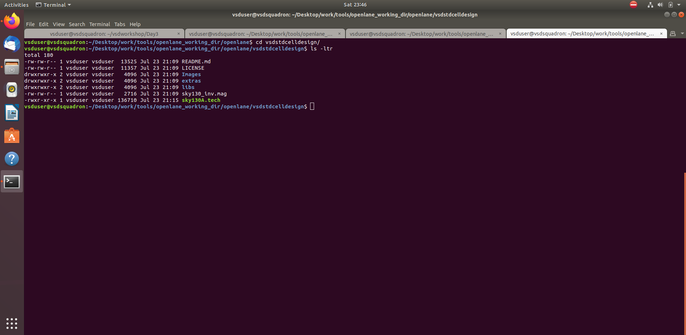
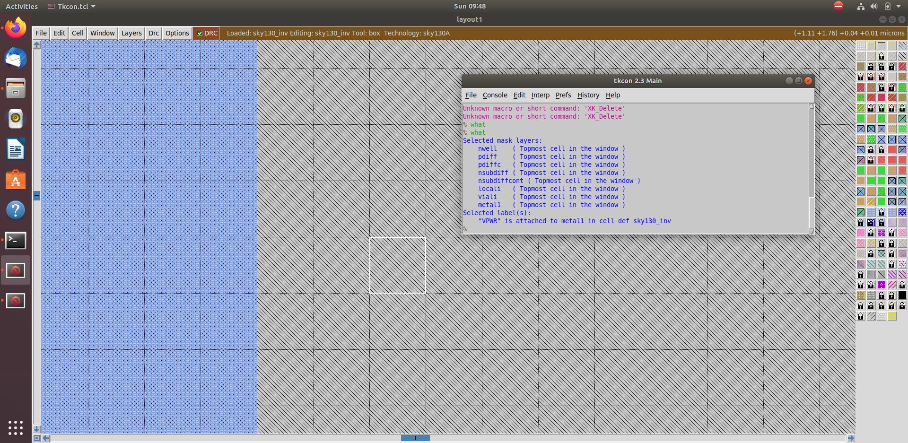
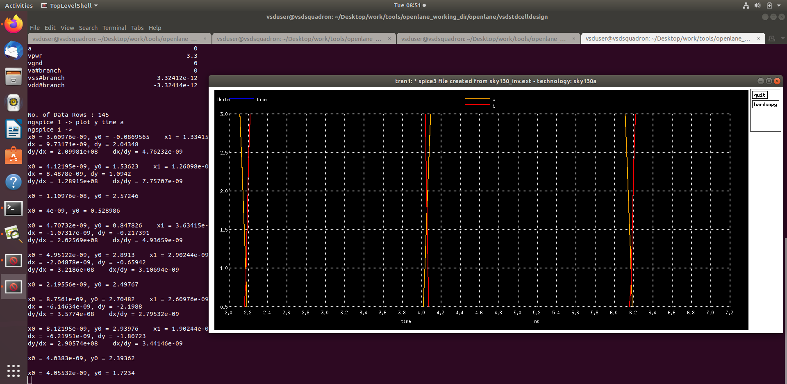
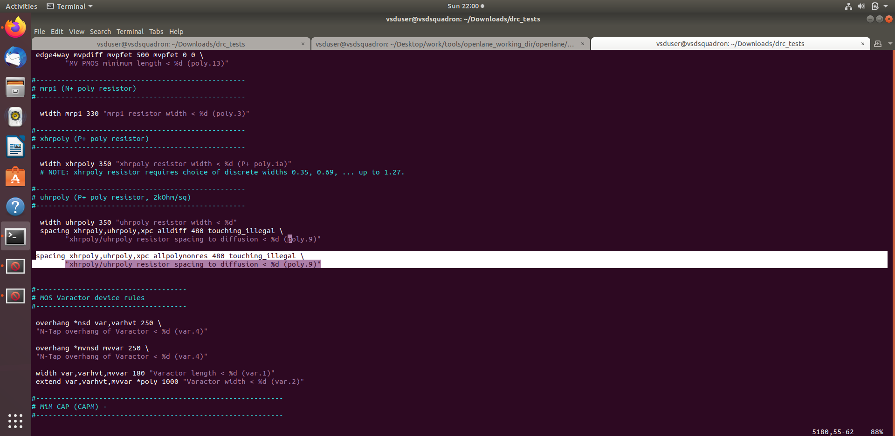

# Sky130 Day 3 - Design Library Cell using Magic Layout and ngspice Characterization

## 1. Introduction

In this session, we explore the physical layout of a CMOS inverter using the Magic VLSI tool and perform SPICE-level characterization using `ngspice` based on the Sky130 PDK. We also dive into DRC (Design Rule Check) debugging and LEF extraction.

---

## 2. SPICE Deck and ngspice Simulation

### 2.1 SPICE Deck Creation for CMOS Inverter

To simulate the inverter's behavior at the transistor level, we create a SPICE netlist that includes transistor definitions, node connectivity, load capacitance, and simulation parameters. This netlist is executed using `ngspice`, which allows us to observe the transient switching characteristics of the circuit.

The SPICE deck is typically saved as `sky130_inv.spice` in the same directory as the layout file created in Magic.

---

#### A typical SPICE deck includes:

- Node definitions (`vdd`, `in`, `0`)
- PMOS and NMOS transistor descriptions with connectivity (Drain-Gate-Source-Bulk)
- Netlist describing circuit structure
- Load capacitance at the output node
- Input signal source (`PULSE` waveform)
- Power rail setup (`vdd` and `gnd`)
- Simulation control directives (e.g., `.tran`, `.dc`)
- Library models for Sky130 PMOS and NMOS devices

---

  


  


 


  


---

## 3. CMOS Fabrication Process – Layout Inception

We visualize each fabrication step layer-by-layer using Magic.

### 3.1 Active Region  
  


### 3.2 N-well and P-well  
  


### 3.3 Gate Terminal Formation  
  


### 3.4 LDD Formation  
  


### 3.5 Source/Drain Formation  
 


### 3.6 Local Interconnect Formation  
 


### 3.7 Higher-Level Metal Formation  
  


### 3.8 Final Complete Layout  
 


  


---

## 4. Layout and LEF Extraction

### 4.1 Clone Inverter Layout Design

- to work in the futher labs clone(download) the below repository at the location `/Desktop/work/tools/openlane_working_dir/openlane`

```bash
git clone https://github.com/nickson-jose/vsdstdcelldesign.git
```
 


- these are the files and folders are in the `vsdstdcelldesign` repo

### 4.2 Open Inverter Layout in Magic

- to open the `sky130_inv.mag` file in magic the command is

```bash
magic -T sky130A.tech sky130_inv.mag
```

- the image below is an inverter layout


- the images below shows about different layers and interconnects in the inverter layout
 


  


  


  


  


 


---

### 4.3 Extract LEF and SPICE Netlist

- to extract lef file from layout using the below commands in the `tkon` window 

```bash
extract all
ext2spice sky130_inv.ext
ext2spice
```


- two files `sky130_inv.ext` and `sky130_inv.spice` are created
  


- the `sky130_inv.ext` file is containing the following contents 
 


---

## 5. Final SPICE Deck with Sky130 Tech

### 5.1 Modify `.option scale`:  

- Editing `.option scale` – 1


- Editing `.option scale` – 2 


- Final `.option scale` line


### 5.2 Use Correct Models  

- `pshort_model.0` for PMOS 

- `nshort_model.0` for NMOS

- PMOS and NMOS models added – 1 


- PMOS and NMOS models added – 2


- Final SPICE deck with Sky130 models
  


---

## 6. Simulation and Characterization

### 6.1 Run ngspice

```bash
ngspice sky130_inv.spice
plot v(a) v(y)
```

- Terminal view of ngspice run 


- Output waveform from simulation
  


### 6.2 Add Capacitance to Reduce Noise

- Final SPICE deck with added capacitance


- Noisy output waveform
 


- Clean output waveform
 


---

## 7. Delay and Transition Analysis

### 7.1 Rise Transition

- 20% of Vmax = 0.66V 

- 80% of Vmax = 2.64V 

- 20% rise voltage point


- 80% rise voltage point 


```
Rise Transition = 2.24 - 2.04 = 0.2ns
```

### 7.2 Rise Delay

  


```
Rise Delay = 2.2466 - 2.21016 = 0.03644ns
```

### 7.3 Fall Transition

  


```
Fall Transition = 4.05532 - 4.053 = 0.00232ns
```

### 7.4 Fall Delay

  


```
Fall Delay = 4.055 - 4.038 = 0.017ns
```

---

## 8. Sky130 Tech DRC Rules and Debugging

### 8.1 Download and Open DRC Labs

```bash
wget http://opencircuitdesign.com/open_pdks/archive/drc_tests.tgz
tar xfz drc_tests.tgz
magic -d XR
```


### 8.2 Inspect and Fix DRC

 


 


  


 


### 8.3 Reload Tech File and Recheck DRC

```bash
tech load sky130A.tech
drc check
```

 


  





---


