# Sky130 Day 4 – Pre-layout Timing Analysis and Clock Tree Optimization

---

## 1. Convert Grid Info to Track Info and Verify Magic Layout

Before integrating a custom standard cell into the PnR flow, we need to ensure it aligns with the design track grid.

**Conditions to Meet:**

- Ports must lie on intersections of horizontal and vertical tracks. 
- Width should be an odd multiple of horizontal pitch. 
- Height should be an even multiple of vertical pitch.

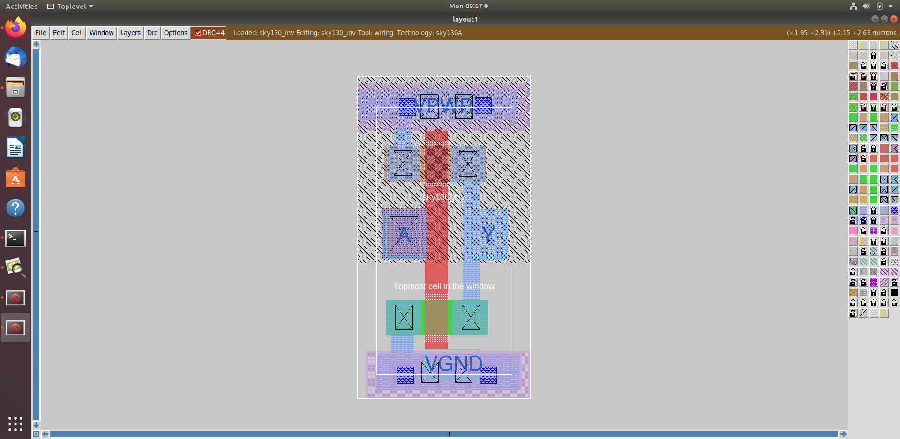 

### Grid and Track Info:

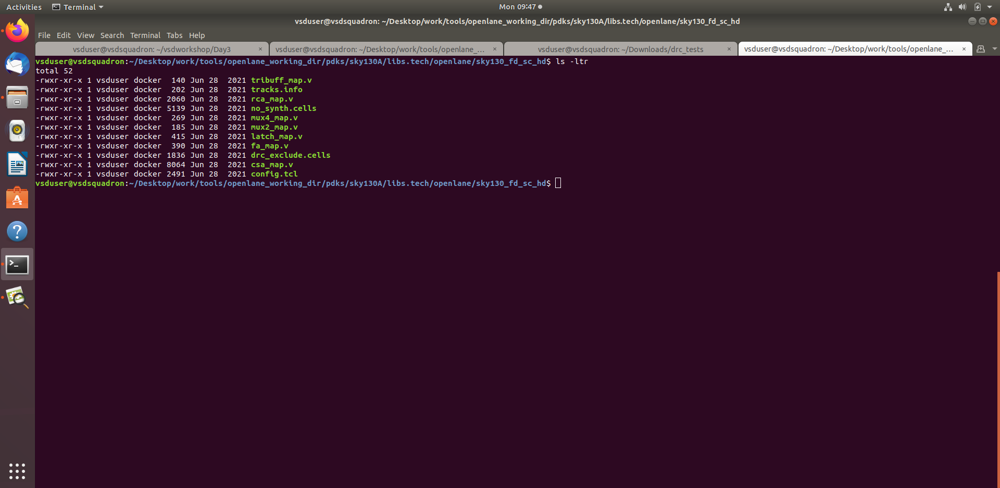 
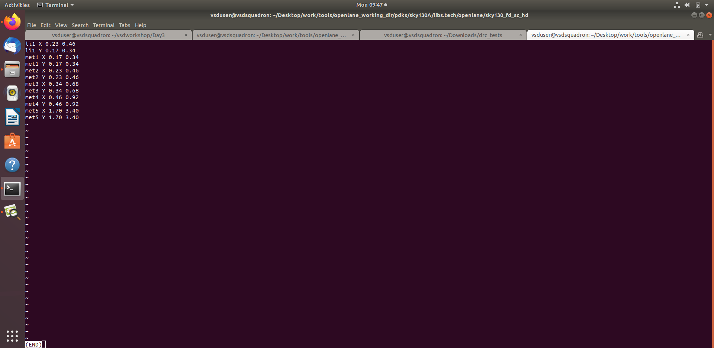

### Initial grid view in Magic:

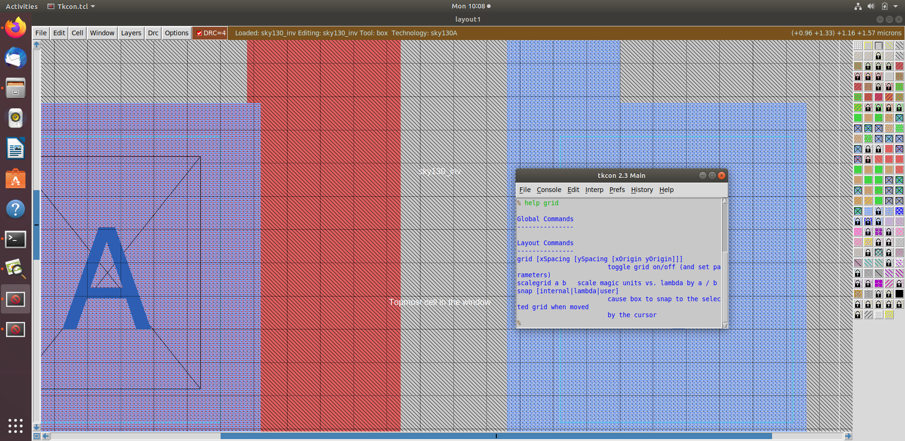

### Resize Grid in Magic:

```tcl
grid 0.46um 0.34um 0.23um 0.17um
```

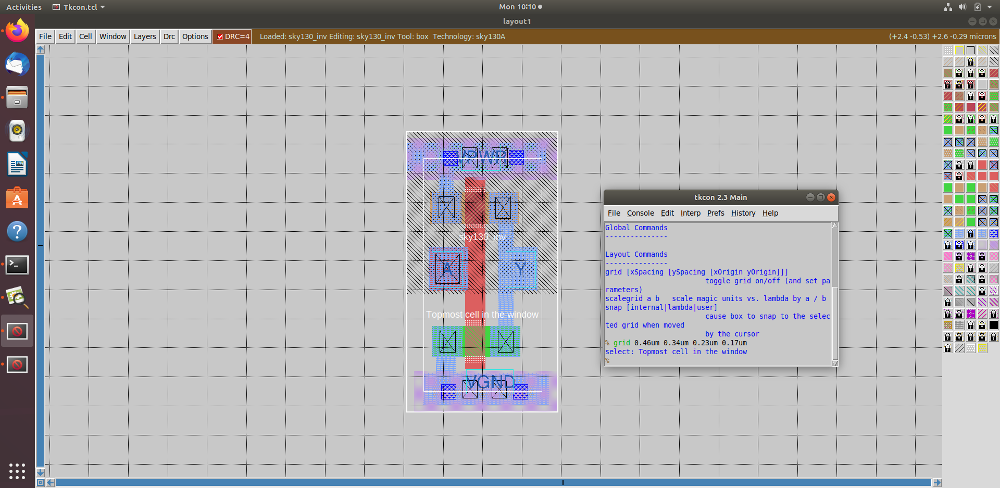 
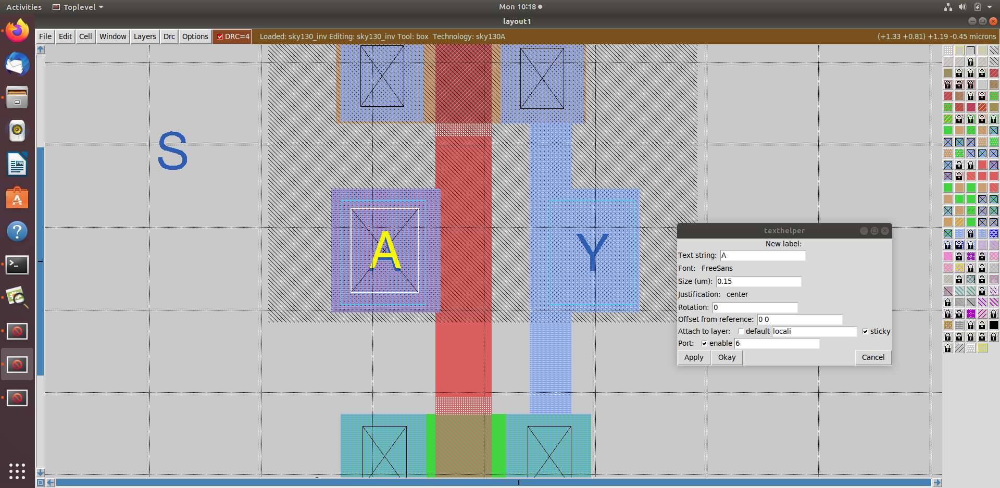

---

## 2. Convert Magic Layout to LEF

In the Magic layout window:

```tcl
lef write sky130_inv.lef
```

This generates a standard cell LEF file that will be used in the OpenLANE flow.

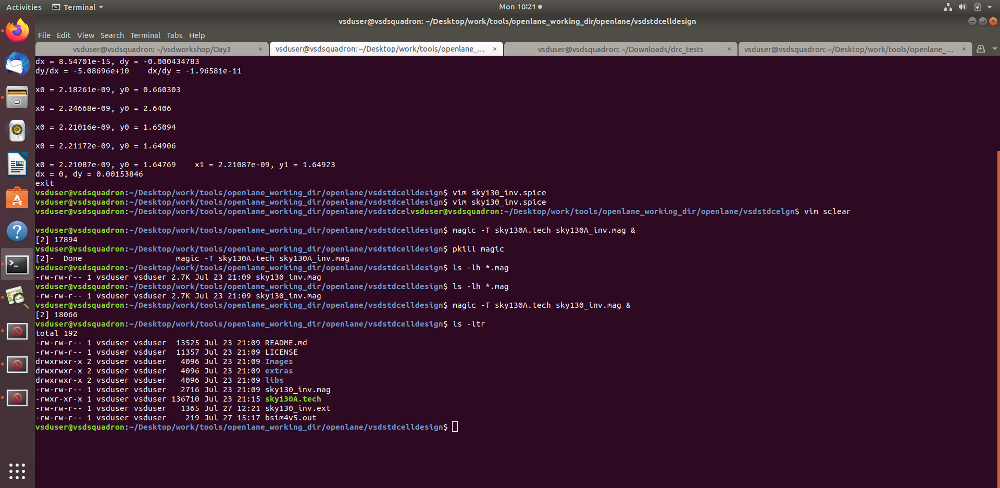

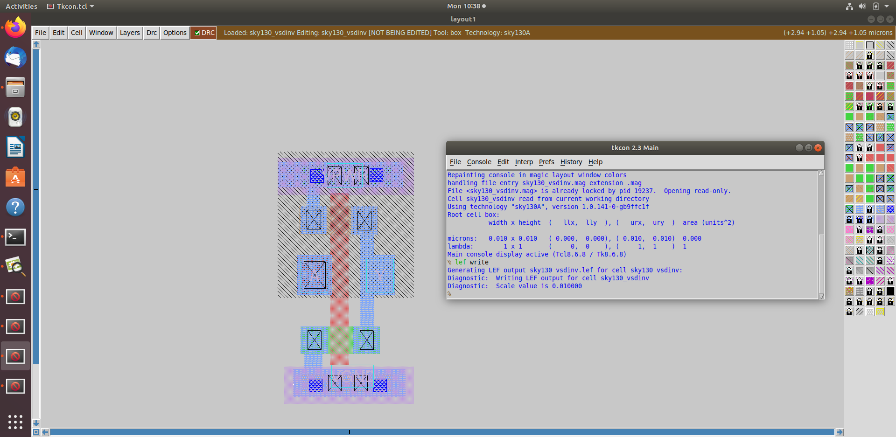

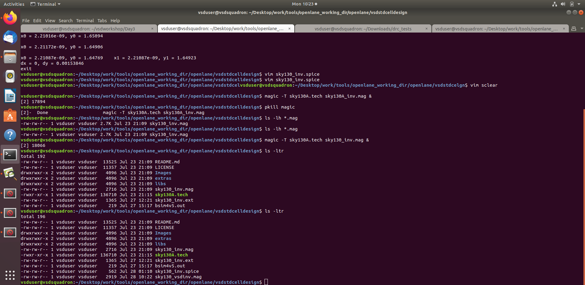

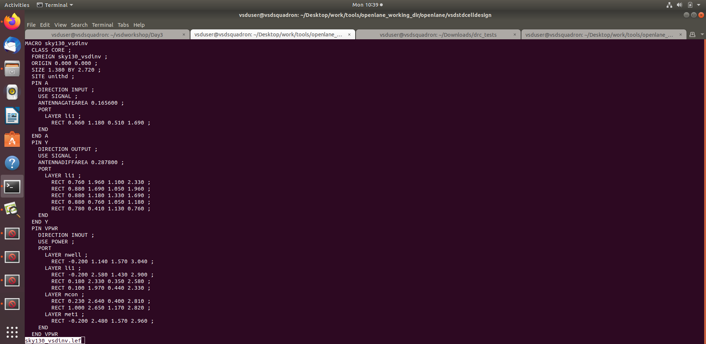
---

## 3. Add Custom Cell to OpenLANE Setup

Open `config.tcl` of the design inside OpenLANE:

```tcl
set ::env(EXTRA_LEFS) "$::env(DESIGN_DIR)/src/sky130_inv.lef"
set ::env(EXTRA_GDS_FILES) "$::env(DESIGN_DIR)/src/sky130_inv.gds"
```

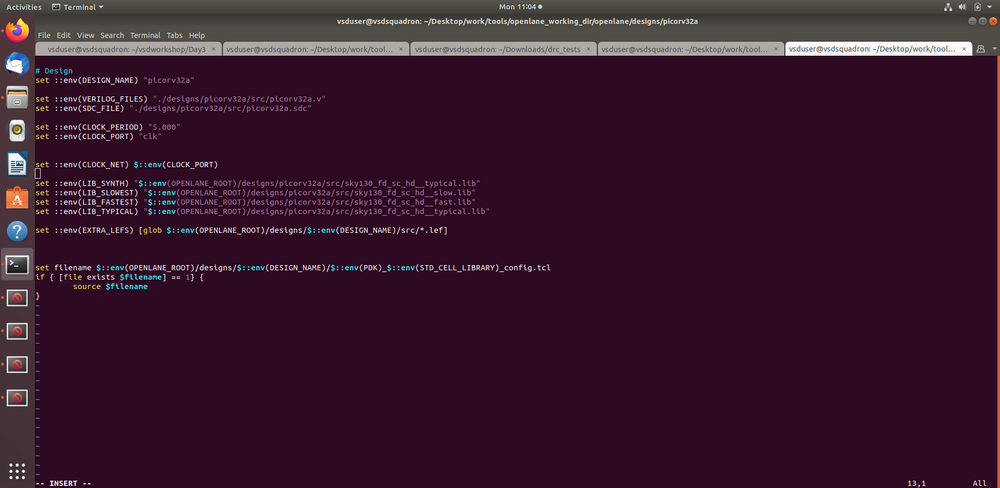

Make sure the custom cell Verilog and Liberty timing model (`sky130_inv.v` and `sky130_inv.lib`) are also copied into the design `src/` folder.

---

## 4. Run Synthesis in OpenLANE

```bash
./flow.tcl -interactive
```

```tcl
package require openlane 0.9
prep -design picorv32a -tag 26-07_06-22 -overwrite

set lefs [glob $::env(DESIGN_DIR)/src/*.lef]
add_lefs -src $lefs

run_synthesis
```

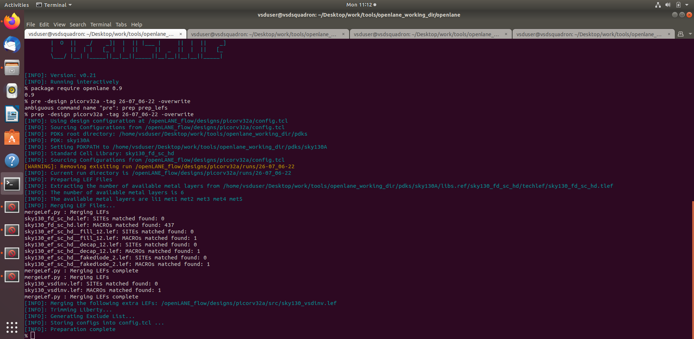 
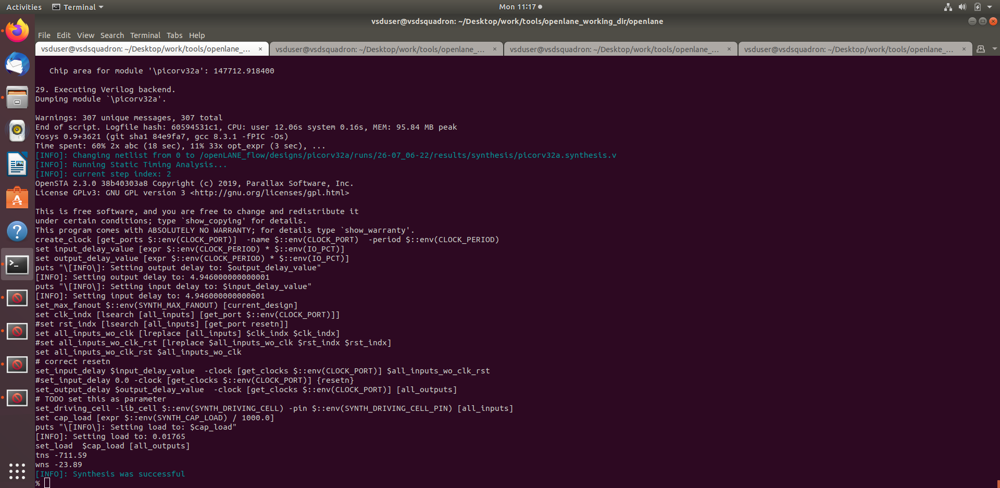

---

## 5. Inverter Cell in Netlist

Check the synthesized netlist for the inverter cell:

```bash
cd runs/picorv32a/results/synthesis/
gedit picorv32a.synthesis.v
```

Search for `sky130_inv`.


---

## 6. Include Inverter Cell in Liberty

Make sure `sky130_inv.lib` is added in config.tcl:

```tcl
set ::env(LIB_SYNTH) "$::env(DESIGN_DIR)/src/sky130_inv.lib"
```


---

## 7. Slack Violation and Delay Analysis

You can now simulate scenarios where slack violations occur, and analyze how `sky130_inv` can be inserted to improve delay.


---

## 8. Timing Analysis with Ideal Clock

```tcl
run_floorplan
run_placement
run_cts
run_sta
```

Observe slack and critical paths.

 
 


---

## 9. Delay Table Overview

Delay tables capture delay across combinations of input transition and output load.

| Input Slew | Output Load | Delay (ns) |
|------------|-------------|------------|
| 0.1ns      | 5fF         | 0.22       |
| 0.2ns      | 10fF        | 0.27       |

These are extracted using SPICE-level simulation and used in `.lib` characterization.


---

## 10. OpenSTA Analysis with Custom Inverter

You can now re-run OpenSTA with a scenario where `sky130_inv` is placed between critical nodes.

```tcl
read_verilog sky130_inv.v
link_design sky130_inv
```

Analyze the new path and compare slack.


---

## 11. Run TritonCTS for Real Clock Network

```tcl
run_cts
```

This performs H-Tree based clock distribution and inserts clock buffers.

 


---

## 12. Setup and Hold Analysis with Real Clock

After CTS:

```tcl
run_sta
```

 


---

## 13. Slack Optimization using Inverter

Analyze where to insert the inverter to adjust delays and improve slack.


---

## 14. Crosstalk and Shielding

High fanout and long clock nets may suffer from crosstalk.

Solution: Shield them with power or ground.


---

# Timing analysis with ideal clocks using OpenSTA

 
 
 
 


---

### Lab Steps to configure OpenSTA for post-synth timing analysis

```tcl
./flow.tcl -interactive
package require openlane 0.9
prep -design picorv32a -tag 16-03_17-49 -overwrite
set lefs [glob $::env(DESIGN_DIR)/src/*.lef]
add_lefs -src $lefs
set ::env(SYNTH_SIZING) 1
run_synthesis
```

> Before moving to post-synth analysis, complete the above steps. 
> To perform post-synthesis timing analysis, first we need to add config files into our flow.

Create a config file at:

```
/home/vsduser/Desktop/work/tools/openlane_working_dir/openlane/pre_sta.conf
```

Add the following content:


```tcl
set_cmd_units -time ns -capacitance pF -current mA -voltage V -resistance kOhm -distance um
read_liberty -min /home/vsduser/Desktop/work/tools/openlane_working_dir/openlane/designs/picorv32a/src/sky130_fd_sc_hd__fast.lib
read_liberty -max /home/vsduser/Desktop/work/tools/openlane_working_dir/openlane/designs/picorv32a/src/sky130_fd_sc_hd__slow.lib
read_verilog /home/vsduser/Desktop/work/tools/openlane_working_dir/openlane/designs/picorv32a/runs/16-03_17-49/results/synthesis/picorv32a.synthesis.v
link_design picorv32a
read_sdc /home/vsduser/Desktop/work/tools/openlane_working_dir/openlane/designs/picorv32a/src/my_base.sdc
report_checks -path_delay min_max -fields {slew trans net cap input_pin}
report_tns
report_wns
```

Create the SDC file at:

```
/home/vsduser/Desktop/work/tools/openlane_working_dir/openlane/designs/picorv32a/src/my_base.sdc
```

Add the following content:


```tcl
set ::env(CLOCK_PORT) clk
set ::env(CLOCK_PERIOD) 24.73
set ::env(SYNTH_DRIVING_CELL) sky130_fd_sc_hd__inv_8
set ::env(SYNTH_DRIVING_CELL_PIN) Y
set ::env(SYNTH_CAP_LOAD) 17.65
create_clock [get_ports $::env(CLOCK_PORT)]  -name $::env(CLOCK_PORT)  -period $::env(CLOCK_PERIOD)
set IO_PCT  0.2
set input_delay_value [expr $::env(CLOCK_PERIOD) * $IO_PCT]
set output_delay_value [expr $::env(CLOCK_PERIOD) * $IO_PCT]
puts "\[INFO\]: Setting output delay to: $output_delay_value"
puts "\[INFO\]: Setting input delay to: $input_delay_value"

set clk_indx [lsearch [all_inputs] [get_port $::env(CLOCK_PORT)]]
#set rst_indx [lsearch [all_inputs] [get_port resetn]]
set all_inputs_wo_clk [lreplace [all_inputs] $clk_indx $clk_indx]
#set all_inputs_wo_clk_rst [lreplace $all_inputs_wo_clk $rst_indx $rst_indx]
set all_inputs_wo_clk_rst $all_inputs_wo_clk

# correct resetn
set_input_delay $input_delay_value  -clock [get_clocks $::env(CLOCK_PORT)] $all_inputs_wo_clk_rst
#set_input_delay 0.0 -clock [get_clocks $::env(CLOCK_PORT)] {resetn}
set_output_delay $output_delay_value  -clock [get_clocks $::env(CLOCK_PORT)] [all_outputs]

# TODO set this as parameter
set_driving_cell -lib_cell $::env(SYNTH_DRIVING_CELL) -pin $::env(SYNTH_DRIVING_CELL_PIN) [all_inputs]
set cap_load [expr $::env(SYNTH_CAP_LOAD) / 1000.0]
puts "\[INFO\]: Setting load to: $cap_load"
set_load  $cap_load [all_outputs]
```

Now go to the OpenLane directory and run:

```bash
sta pre_sta.conf
```

This performs post-synthesis timing analysis.

 
 


---

### Changing MAX_FANOUT to 4 and Re-running Synthesis

```tcl
./flow.tcl -interactive
package require openlane 0.9
prep -design picorv32a -tag 16-03_17-49 -overwrite
set lefs [glob $::env(DESIGN_DIR)/src/*.lef]
add_lefs -src $lefs
set ::env(SYNTH_SIZING) 1
set ::env(SYNTH_MAX_FANOUT) 4
run_synthesis
```

---

 

 
 


# Clock Tree Synthesis (CTS) using TritonCTS and Signal Integrity

## Introduction to CTS and Signal Integrity


- So we go for `H-Tree` method


- After adding buffers 👇


## Clock Net Shielding 👇


- therefore the clock net is shieled 


## Lab Steps to run CTS using TritonCTS

- From the previous labs, run until the placement stage using the commands:

```tcl
prep -design picorv32a -tag 16-03_17-49 -overwrite
set lefs [glob $::env(DESIGN_DIR)/src/*.lef]
add_lefs -src $lefs

set ::env(SYNTH_STRATEGY) "DELAY 0"
set ::env(SYNTH_SIZING) 1

run_synthesis
init_floorplan
place_io
global_placement_or
detailed_placement
tap_decap_or
detailed_placement
```

- After placement is done, we move on to the CTS stage and run it using the command:

```tcl
run_cts
```

- This uses `TritonCTS` inside OpenROAD to insert clock buffers and route the clock net.

## Output After CTS Stage


## Verifying if CTS is Run Properly or Not


# Timing analysis with real clocks

---

## Setup time Analysis

  
  
  

---

## Hold time Analysis

  
  
  
  
  

---

## LAB - Steps to analyze timing with real clocks

### 1. Run CTS  
Use the command:
```bash
run_cts
```

#### Output:
  
  
  

---

### 2. Post-CTS Timing Analysis using OpenROAD

Launch OpenROAD and run the following commands:

```tcl
openroad
read_lef /openLANE_flow/designs/picorv32a/runs/16-03_17-49/tmp/merged.lef
read_def /openLANE_flow/designs/picorv32a/runs/16-03_17-49/results/cts/picorv32a.cts.def
write_db pico_cts.db
read_db pico_cts.db
read_verilog /openLANE_flow/designs/picorv32a/runs/16-03_17-49/results/synthesis/picorv32a.synthesis_cts.v
read_liberty $::env(LIB_TYPICAL)
link_design picorv32a
read_sdc /openLANE_flow/designs/picorv32a/src/my_base.sdc
set_propagated_clock [all_clocks]
report_checks -path_delay min_max -format full_clock_expanded -digits 4
```

#### Output:
  
  
  

---

## LAB - Observe impact of bigger CTS buffers on setup/hold

```tcl
echo $::env(CTS_CLK_BUFFER_LIST)
set ::env(CTS_CLK_BUFFER_LIST) [lreplace $::env(CTS_CLK_BUFFER_LIST) 0 0]

echo $::env(CURRENT_DEF)
set ::env(CURRENT_DEF) /openLANE_flow/designs/picorv32a/runs/16-03_17-49/results/placement/picorv32a.placement.def

run_cts
echo $::env(CTS_CLK_BUFFER_LIST)

openroad

read_lef /openLANE_flow/designs/picorv32a/runs/16-03_17-49/tmp/merged.lef
read_def /openLANE_flow/designs/picorv32a/runs/16-03_17-49/results/cts/picorv32a.cts.def
write_db pico_cts1.db
read_db pico_cts1.db
read_verilog /openLANE_flow/designs/picorv32a/runs/16-03_17-49/results/synthesis/picorv32a.synthesis_cts.v
read_liberty $::env(LIB_TYPICAL)
link_design picorv32a
read_sdc /openLANE_flow/designs/picorv32a/src/my_base.sdc
set_propagated_clock [all_clocks]
report_checks -path_delay min_max -fields {slew trans net cap input_pins} -format full_clock_expanded -digits 4

report_clock_skew -hold
report_clock_skew -setup
```

#### Output:
  
  
  
  

---

### Insert smaller buffer (sky130_fd_sc_hd__clkbuf_1)

```tcl
echo $::env(CTS_CLK_BUFFER_LIST)
set ::env(CTS_CLK_BUFFER_LIST) [linsert $::env(CTS_CLK_BUFFER_LIST) 0 sky130_fd_sc_hd__clkbuf_1]
```


---

### Timing Comparison Results

```text
For clkbuf_1
    hold slack -   0.1127   slack (MET)
    setup slack -  13.8266  slack (MET)

For clkbuf_2
    hold slack -   0.2892   slack (MET)
    setup slack -  13.8266  slack (MET)
```

 **Observation**: Hold slack improved when using `clkbuf_2`.


