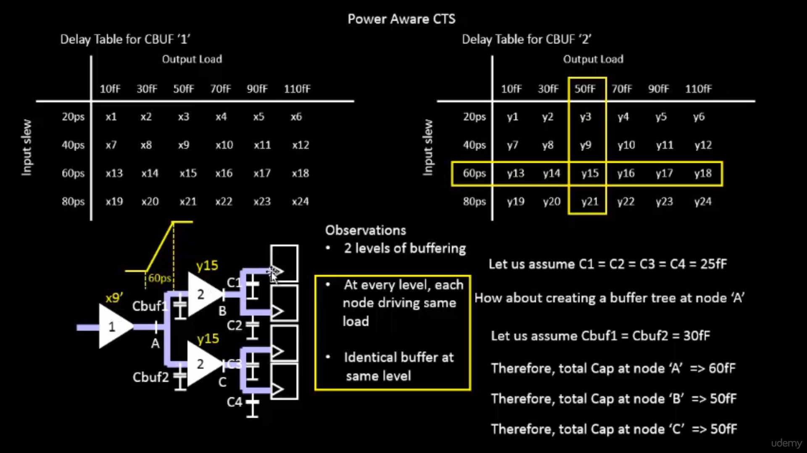

# Sky130 Day 4 – Pre-layout Timing Analysis and Importance of a Good Clock Tree

---

## Timing Modelling using Delay Tables

---

## Lab Steps to Convert Grid Info to Track Info

We only require the `.lef` file, which contains the cell physical information; we don't need all the information in the `.mag` file.

So we have to extract the `.lef` file from the `.mag` file.

This is the inverter we have seen from the previous labs.


### Inverter Layout

There are some conditions that need to be satisfied before we place standard cells into the PnR flow:

- Input and output ports of the standard cell should lie on the intersection of the vertical and horizontal tracks.
- Width of the standard cell should be odd multiples of the horizontal track pitch.
- Height of the standard cell should be even multiples of the vertical track pitch.

In the below location, we can find the `tracks.info` for `sky130_fd_sc_hd`.

- Track Info 1 

  

- Track Info 2 

  

Initially the grid size looks like this:

- **Original Grid**
 
  

Now resize the grid as per the dimensions in `tracks.info`:

```
grid 0.46um 0.34um 0.23um 0.17um
```

- **Resized Grid 1** 


Here, the input and output ports (A and Y) are lying on the intersection of the vertical and horizontal pitch ✅

- Horizontal track pitch = 0.46um → width = 3 × 0.46 = 1.38um ✅ 
  
 
- Vertical track pitch = 0.34um → height = 8 × 0.34 = 2.72um ✅

 

### Save Layout

```tcl
save sky130_vsdinv.mag
magic -T sky130A.tech sky130_vsdinv.mag &
```
Generate `.lef` file:

```tcl
lef write
```

- **LEF Write** 


  


---

## Copy `.lef` and `.lib` Files to OpenLANE src Directory

```bash
cp libs/sky130_fd_sc_hd__* ~/Desktop/work/tools/openlane_working_dir/openlane/designs/picorv32a/src/
cp sky130_vsdinv.lef ~/Desktop/work/tools/openlane_working_dir/openlane/designs/picorv32a/src/
```

- **Copied Files Result** 
 

  


---

## Update `config.tcl` with New File Paths

```tcl
set ::env(LIB_SYNTH) "$::env(OPENLANE_ROOT)/designs/picorv32a/src/sky130_fd_sc_hd__typical.lib"
set ::env(LIB_SLOWEST) "$::env(OPENLANE_ROOT)/designs/picorv32a/src/sky130_fd_sc_hd__slow.lib"
set ::env(LIB_FASTEST) "$::env(OPENLANE_ROOT)/designs/picorv32a/src/sky130_fd_sc_hd__fast.lib"
set ::env(LIB_TYPICAL) "$::env(OPENLANE_ROOT)/designs/picorv32a/src/sky130_fd_sc_hd__typical.lib"

set ::env(EXTRA_LEFS) [glob $::env(OPENLANE_ROOT)/designs/$::env(DESIGN_NAME)/src/*.lef]
```

- **Updated Config**

  

- **sky130_fd_sc_hd__typical.lib**
  
  

- **sky130_fd_sc_hd__slow.lib**

  

- **sky130_fd_sc_hd__fast.lib**

  

---

## Start OpenLANE Flow

```tcl
./flow.tcl -interactive
package require openlane 0.9
prep -design picorv32a -tag 26-07_06-22 -overwrite
set lefs [glob $::env(DESIGN_DIR)/src/*.lef]
add_lefs -src $lefs
run_synthesis
```

- **Run Synthesis 1** 

  

- **Run Synthesis 2** 

  

---

## Delay Tables

To avoid large skew between clock endpoints:

- Buffers on the same level must have same load → same delay
- Buffers must be identical across levels

- **Delay Table 1** 

  

- **Delay Table 2** 

  

- **Delay Table 3** 

  

- **Delay Table 4** 

  

**Skew = 0** because delay on both paths = x9' + y15

---

## Steps to Configure Synthesis to Fix Slack

View slack-related synthesis parameters in `README.md`

- **Synthesis Params** 

  

Update synthesis settings:

```tcl
prep -design picorv32a -tag 26-07_06-22 -overwrite
set lefs [glob $::env(DESIGN_DIR)/src/*.lef]
add_lefs -src $lefs

echo $::env(SYNTH_STRATEGY)
set ::env(SYNTH_STRATEGY) "DELAY 0"

echo $::env(SYNTH_BUFFERING)
echo $::env(SYNTH_SIZING)
set ::env(SYNTH_SIZING) 1

echo $::env(SYNTH_DRIVING_CELL)

run_synthesis
```

- **Updated Synth Output 1** 

  

- **Updated Synth Output 2** 

  

**Before:**

```
Chip area: 147712.918400
tns: -711.59
wns: -23.89
```

**After:**

```
Chip area: 196832.528000
tns: 0
wns: 0
```
 

To verify inverter inclusion, search `merged.lef` for `vsdinv`

- **LEF verification 1** 

  

- **LEF verification 2** 

  

---

## Floorplanning and Placement

```tcl
run_floorplan
```

If error appears, refer to OpenLANE commands documentation

- **OpenLANE Error** 

  

- **Commands Ref** 

  

Then run:

```tcl
init_floorplan
place_io
global_placement_or
detailed_placement
tap_decap_or
detailed_placement
```

- **init_floorplan** 

  

- **place_io** 

  

- **global_placement_or** 

  

- **detailed_placement** 

  

- **tap_decap_or**
  
  

- **detailed_placement**

  

---

## View Placement in Magic

```tcl
magic -T /home/vsduser/Desktop/work/tools/openlane_working_dir/pdks/sky130A/libs.tech/magic/sky130A.tech \
lef read ../../tmp/merged.lef \
def read picorv32a.placement.def &
```
 

- **Magic View**

  

 
  


  


  


  


  


  


## 5. Netlist and Cell Verification

Open the synthesized Verilog and confirm that `sky130_inv` is used.

```bash
cat runs/vsdinv_synth/results/synthesis/picorv32a.v | grep sky130_inv
```


---

## 6. Delay Table (lib) Setup and Format

Your custom `.lib` file should have a delay table section like:

```liberty
cell (sky130_inv) {
  ...
  pin(A) {
    direction : input;
    ...
  }
  pin(Y) {
    direction : output;
    function : "A'";
    ...
    timing () {
      related_pin : "A";
      timing_sense : negative_unate;
      cell_rise(delay_table) {...}
      cell_fall(delay_table) {...}
    }
  }
}
```


---

## 7. Setup OpenSTA for Ideal Clock Timing Analysis

```bash
cd openlane/designs/picorv32a
opensta
```

```tcl
read_liberty /path/to/sky130_inv.lib
read_verilog runs/vsdinv_synth/results/synthesis/picorv32a.v
link_design picorv32a
read_sdc runs/vsdinv_synth/results/synthesis/picorv32a.sdc
report_checks -path_delay min_max
```


---

## 8. Run TritonCTS (Clock Tree Synthesis)

```bash
flow.tcl -design picorv32a -tag vsdinv_cts -from cts
```

This step inserts and buffers clock tree using your given CTS buffer.


---

## 9. Post-CTS Setup & Hold Timing Analysis

```bash
cd runs/vsdinv_cts/results/cts
opensta
```

```tcl
read_liberty /path/to/sky130_inv.lib
read_verilog picorv32a.cts.v
link_design picorv32a
read_sdc picorv32a.sdc
report_checks -path_delay min_max
```

Check for any setup or hold violations after CTS.


---

## 10. Slack Optimization using Synthesis Configuration

You can optimize slack by adjusting synthesis constraints in `config.tcl`:

```tcl
set ::env(SYNTH_MAX_TRAN) 0.75
set ::env(SYNTH_MAX_FANOUT) 4
set ::env(SYNTH_STRATEGY) 2
```

Re-run synthesis and STA again.


---

## 11. Crosstalk and Shielding

To minimize signal interference, ensure critical nets are shielded.

Use:

```tcl
set ::env(PL_TARGET_DENSITY) 0.50
set ::env(FP_PDN_VOFFSET) 10
```

Then re-run `flow.tcl`.


---

## Final Result Summary

```tcl
report_checks -path_delay min_max
```

Expected result:

- **Setup Slack**: MET
- **Hold Slack**: MET


### Lab Steps to configure OpenSTA for post-synth timing analysis

```tcl
./flow.tcl -interactive
package require openlane 0.9
prep -design picorv32a -tag 16-03_17-49 -overwrite
set lefs [glob $::env(DESIGN_DIR)/src/*.lef]
add_lefs -src $lefs
set ::env(SYNTH_SIZING) 1
run_synthesis
```

> Before moving to post-synth analysis, complete the above steps. 
> To perform post-synthesis timing analysis, first we need to add config files into our flow.

Create a config file at:

```
/home/vsduser/Desktop/work/tools/openlane_working_dir/openlane/pre_sta.conf
```

Add the following content:


```tcl
set_cmd_units -time ns -capacitance pF -current mA -voltage V -resistance kOhm -distance um
read_liberty -min /home/vsduser/Desktop/work/tools/openlane_working_dir/openlane/designs/picorv32a/src/sky130_fd_sc_hd__fast.lib
read_liberty -max /home/vsduser/Desktop/work/tools/openlane_working_dir/openlane/designs/picorv32a/src/sky130_fd_sc_hd__slow.lib
read_verilog /home/vsduser/Desktop/work/tools/openlane_working_dir/openlane/designs/picorv32a/runs/16-03_17-49/results/synthesis/picorv32a.synthesis.v
link_design picorv32a
read_sdc /home/vsduser/Desktop/work/tools/openlane_working_dir/openlane/designs/picorv32a/src/my_base.sdc
report_checks -path_delay min_max -fields {slew trans net cap input_pin}
report_tns
report_wns
```

Create the SDC file at:

```
/home/vsduser/Desktop/work/tools/openlane_working_dir/openlane/designs/picorv32a/src/my_base.sdc
```

Add the following content:


```tcl
set ::env(CLOCK_PORT) clk
set ::env(CLOCK_PERIOD) 24.73
set ::env(SYNTH_DRIVING_CELL) sky130_fd_sc_hd__inv_8
set ::env(SYNTH_DRIVING_CELL_PIN) Y
set ::env(SYNTH_CAP_LOAD) 17.65
create_clock [get_ports $::env(CLOCK_PORT)]  -name $::env(CLOCK_PORT)  -period $::env(CLOCK_PERIOD)
set IO_PCT  0.2
set input_delay_value [expr $::env(CLOCK_PERIOD) * $IO_PCT]
set output_delay_value [expr $::env(CLOCK_PERIOD) * $IO_PCT]
puts "\[INFO\]: Setting output delay to: $output_delay_value"
puts "\[INFO\]: Setting input delay to: $input_delay_value"

set clk_indx [lsearch [all_inputs] [get_port $::env(CLOCK_PORT)]]
#set rst_indx [lsearch [all_inputs] [get_port resetn]]
set all_inputs_wo_clk [lreplace [all_inputs] $clk_indx $clk_indx]
#set all_inputs_wo_clk_rst [lreplace $all_inputs_wo_clk $rst_indx $rst_indx]
set all_inputs_wo_clk_rst $all_inputs_wo_clk

# correct resetn
set_input_delay $input_delay_value  -clock [get_clocks $::env(CLOCK_PORT)] $all_inputs_wo_clk_rst
#set_input_delay 0.0 -clock [get_clocks $::env(CLOCK_PORT)] {resetn}
set_output_delay $output_delay_value  -clock [get_clocks $::env(CLOCK_PORT)] [all_outputs]

# TODO set this as parameter
set_driving_cell -lib_cell $::env(SYNTH_DRIVING_CELL) -pin $::env(SYNTH_DRIVING_CELL_PIN) [all_inputs]
set cap_load [expr $::env(SYNTH_CAP_LOAD) / 1000.0]
puts "\[INFO\]: Setting load to: $cap_load"
set_load  $cap_load [all_outputs]
```

Now go to the OpenLane directory and run:

```bash
sta pre_sta.conf
```

This performs post-synthesis timing analysis.

 
 


---

### Changing MAX_FANOUT to 4 and Re-running Synthesis

```tcl
./flow.tcl -interactive
package require openlane 0.9
prep -design picorv32a -tag 16-03_17-49 -overwrite
set lefs [glob $::env(DESIGN_DIR)/src/*.lef]
add_lefs -src $lefs
set ::env(SYNTH_SIZING) 1
set ::env(SYNTH_MAX_FANOUT) 4
run_synthesis
```

---

 

 
 


# Clock Tree Synthesis (CTS) using TritonCTS and Signal Integrity

## Introduction to CTS and Signal Integrity


- So we go for `H-Tree` method


- After adding buffers 👇


## Clock Net Shielding 👇


- therefore the clock net is shieled 


## Lab Steps to run CTS using TritonCTS

- From the previous labs, run until the placement stage using the commands:

```tcl
prep -design picorv32a -tag 16-03_17-49 -overwrite
set lefs [glob $::env(DESIGN_DIR)/src/*.lef]
add_lefs -src $lefs

set ::env(SYNTH_STRATEGY) "DELAY 0"
set ::env(SYNTH_SIZING) 1

run_synthesis
init_floorplan
place_io
global_placement_or
detailed_placement
tap_decap_or
detailed_placement
```

- After placement is done, we move on to the CTS stage and run it using the command:

```tcl
run_cts
```

- This uses `TritonCTS` inside OpenROAD to insert clock buffers and route the clock net.

## Output After CTS Stage


## Verifying if CTS is Run Properly or Not


# Timing analysis with real clocks

---

## Setup time Analysis

  
  
  

---

## Hold time Analysis

  
  
  
  
  

---

## LAB - Steps to analyze timing with real clocks

### 1. Run CTS  
Use the command:
```bash
run_cts
```

#### Output:
  
  
  

---

### 2. Post-CTS Timing Analysis using OpenROAD

Launch OpenROAD and run the following commands:

```tcl
openroad
read_lef /openLANE_flow/designs/picorv32a/runs/16-03_17-49/tmp/merged.lef
read_def /openLANE_flow/designs/picorv32a/runs/16-03_17-49/results/cts/picorv32a.cts.def
write_db pico_cts.db
read_db pico_cts.db
read_verilog /openLANE_flow/designs/picorv32a/runs/16-03_17-49/results/synthesis/picorv32a.synthesis_cts.v
read_liberty $::env(LIB_TYPICAL)
link_design picorv32a
read_sdc /openLANE_flow/designs/picorv32a/src/my_base.sdc
set_propagated_clock [all_clocks]
report_checks -path_delay min_max -format full_clock_expanded -digits 4
```

#### Output:
  
  
  

---

## LAB - Observe impact of bigger CTS buffers on setup/hold

```tcl
echo $::env(CTS_CLK_BUFFER_LIST)
set ::env(CTS_CLK_BUFFER_LIST) [lreplace $::env(CTS_CLK_BUFFER_LIST) 0 0]

echo $::env(CURRENT_DEF)
set ::env(CURRENT_DEF) /openLANE_flow/designs/picorv32a/runs/16-03_17-49/results/placement/picorv32a.placement.def

run_cts
echo $::env(CTS_CLK_BUFFER_LIST)

openroad

read_lef /openLANE_flow/designs/picorv32a/runs/16-03_17-49/tmp/merged.lef
read_def /openLANE_flow/designs/picorv32a/runs/16-03_17-49/results/cts/picorv32a.cts.def
write_db pico_cts1.db
read_db pico_cts1.db
read_verilog /openLANE_flow/designs/picorv32a/runs/16-03_17-49/results/synthesis/picorv32a.synthesis_cts.v
read_liberty $::env(LIB_TYPICAL)
link_design picorv32a
read_sdc /openLANE_flow/designs/picorv32a/src/my_base.sdc
set_propagated_clock [all_clocks]
report_checks -path_delay min_max -fields {slew trans net cap input_pins} -format full_clock_expanded -digits 4

report_clock_skew -hold
report_clock_skew -setup
```

#### Output:
  
  
  
  

---

### Insert smaller buffer (sky130_fd_sc_hd__clkbuf_1)

```tcl
echo $::env(CTS_CLK_BUFFER_LIST)
set ::env(CTS_CLK_BUFFER_LIST) [linsert $::env(CTS_CLK_BUFFER_LIST) 0 sky130_fd_sc_hd__clkbuf_1]
```


---

### Timing Comparison Results

```text
For clkbuf_1
    hold slack -   0.1127   slack (MET)
    setup slack -  13.8266  slack (MET)

For clkbuf_2
    hold slack -   0.2892   slack (MET)
    setup slack -  13.8266  slack (MET)
```

 **Observation**: Hold slack improved when using `clkbuf_2`.


