# Sky130 Day 4 – Pre-layout Timing Analysis and Importance of a Good Clock Tree

---

## Timing Modelling using Delay Tables

---

## Lab Steps to Convert Grid Info to Track Info

We only require the `.lef` file, which contains the cell physical information; we don't need all the information in the `.mag` file.

So we have to extract the `.lef` file from the `.mag` file.

This is the inverter we have seen from the previous labs.


### Inverter Layout

There are some conditions that need to be satisfied before we place standard cells into the PnR flow:

- Input and output ports of the standard cell should lie on the intersection of the vertical and horizontal tracks.
- Width of the standard cell should be odd multiples of the horizontal track pitch.
- Height of the standard cell should be even multiples of the vertical track pitch.

In the below location, we can find the `tracks.info` for `sky130_fd_sc_hd`.

- Track Info 1 

  

- Track Info 2 

  

Initially the grid size looks like this:

- **Original Grid**
 
  

Now resize the grid as per the dimensions in `tracks.info`:

```
grid 0.46um 0.34um 0.23um 0.17um
```

- **Resized Grid 1** 


Here, the input and output ports (A and Y) are lying on the intersection of the vertical and horizontal pitch ✅

- Horizontal track pitch = 0.46um → width = 3 × 0.46 = 1.38um ✅ 
  
 
- Vertical track pitch = 0.34um → height = 8 × 0.34 = 2.72um ✅

 

### Save Layout

```tcl
save sky130_vsdinv.mag
magic -T sky130A.tech sky130_vsdinv.mag &
```
Generate `.lef` file:

```tcl
lef write
```

- **LEF Write** 


  


---

## Copy `.lef` and `.lib` Files to OpenLANE src Directory

```bash
cp libs/sky130_fd_sc_hd__* ~/Desktop/work/tools/openlane_working_dir/openlane/designs/picorv32a/src/
cp sky130_vsdinv.lef ~/Desktop/work/tools/openlane_working_dir/openlane/designs/picorv32a/src/
```

- **Copied Files Result** 
 

  


---

## Update `config.tcl` with New File Paths

```tcl
set ::env(LIB_SYNTH) "$::env(OPENLANE_ROOT)/designs/picorv32a/src/sky130_fd_sc_hd__typical.lib"
set ::env(LIB_SLOWEST) "$::env(OPENLANE_ROOT)/designs/picorv32a/src/sky130_fd_sc_hd__slow.lib"
set ::env(LIB_FASTEST) "$::env(OPENLANE_ROOT)/designs/picorv32a/src/sky130_fd_sc_hd__fast.lib"
set ::env(LIB_TYPICAL) "$::env(OPENLANE_ROOT)/designs/picorv32a/src/sky130_fd_sc_hd__typical.lib"

set ::env(EXTRA_LEFS) [glob $::env(OPENLANE_ROOT)/designs/$::env(DESIGN_NAME)/src/*.lef]
```

- **Updated Config**

  

- **sky130_fd_sc_hd__typical.lib**
  
  

- **sky130_fd_sc_hd__slow.lib**

  

- **sky130_fd_sc_hd__fast.lib**

  

---

## Start OpenLANE Flow

```tcl
./flow.tcl -interactive
package require openlane 0.9
prep -design picorv32a -tag 26-07_06-22 -overwrite
set lefs [glob $::env(DESIGN_DIR)/src/*.lef]
add_lefs -src $lefs
run_synthesis
```

- **Run Synthesis 1** 

  

- **Run Synthesis 2** 

  

---

## Delay Tables

To avoid large skew between clock endpoints:

- Buffers on the same level must have same load → same delay
- Buffers must be identical across levels

- **Delay Table 1** 

  

- **Delay Table 2** 

  

- **Delay Table 3** 

  

- **Delay Table 4** 

  

**Skew = 0** because delay on both paths = x9' + y15

---

## Steps to Configure Synthesis to Fix Slack

View slack-related synthesis parameters in `README.md`

- **Synthesis Params** 

  

Update synthesis settings:

```tcl
prep -design picorv32a -tag 26-07_06-22 -overwrite
set lefs [glob $::env(DESIGN_DIR)/src/*.lef]
add_lefs -src $lefs

echo $::env(SYNTH_STRATEGY)
set ::env(SYNTH_STRATEGY) "DELAY 0"

echo $::env(SYNTH_BUFFERING)
echo $::env(SYNTH_SIZING)
set ::env(SYNTH_SIZING) 1

echo $::env(SYNTH_DRIVING_CELL)

run_synthesis
```

- **Updated Synth Output 1** 

  

- **Updated Synth Output 2** 

  

**Before:**

```
Chip area: 147712.918400
tns: -711.59
wns: -23.89
```

**After:**

```
Chip area: 196832.528000
tns: 0
wns: 0
```
 

To verify inverter inclusion, search `merged.lef` for `vsdinv`

- **LEF verification 1** 

  

- **LEF verification 2** 

  

---

## Floorplanning and Placement

```tcl
run_floorplan
```

If error appears, refer to OpenLANE commands documentation

- **OpenLANE Error** 

  

- **Commands Ref** 

  

Then run:

```tcl
init_floorplan
place_io
global_placement_or
detailed_placement
tap_decap_or
detailed_placement
```

- **init_floorplan** 

  

- **place_io** 

  

- **global_placement_or** 

  

- **detailed_placement** 

  

- **tap_decap_or**
  
  

- **detailed_placement**

  

---

## View Placement in Magic

```tcl
magic -T /home/vsduser/Desktop/work/tools/openlane_working_dir/pdks/sky130A/libs.tech/magic/sky130A.tech \
lef read ../../tmp/merged.lef \
def read picorv32a.placement.def &
```
 

- **Magic View**

  

 
  


  


  


  


  


  

# Timing Analysis with Ideal Clocks using OpenSTA


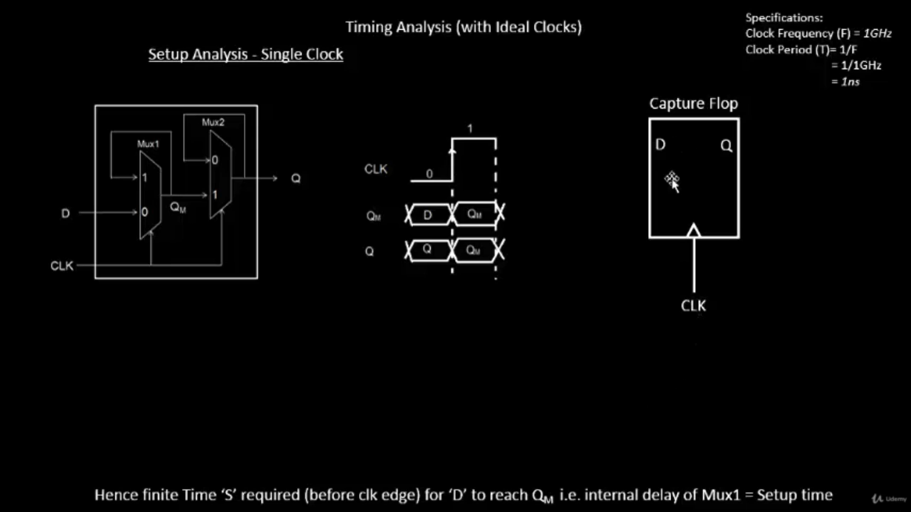


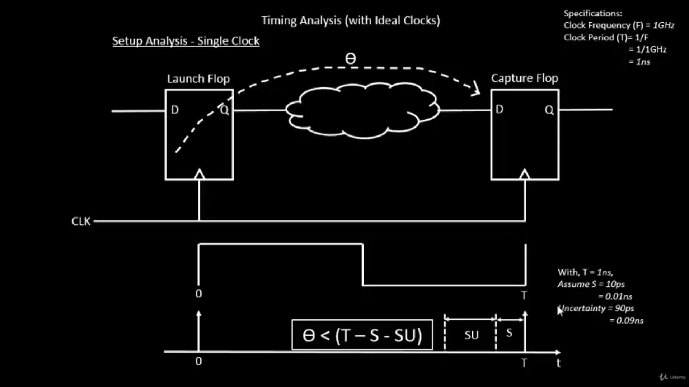

---

## Step 1: Initial Setup and Synthesis

```bash
./flow.tcl -interactive
package require openlane 0.9
prep -design picorv32a -tag 26-07_06-22 -overwrite
set lefs [glob $::env(DESIGN_DIR)/src/*.lef]
add_lefs -src $lefs
set ::env(SYNTH_SIZING) 1
run_synthesis
```

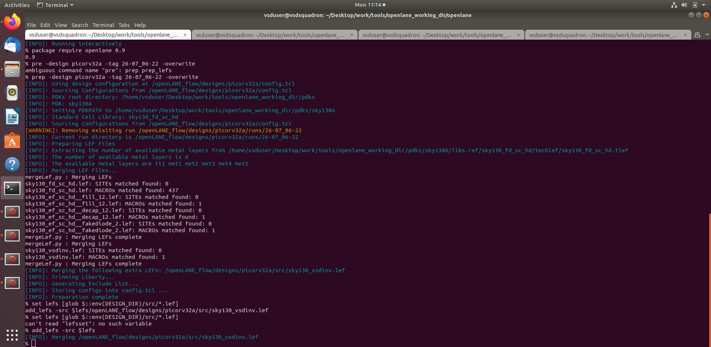

---

## Step 2: Create the STA Configuration File

Path:
```
/home/vsduser/Desktop/work/tools/openlane_working_dir/openlane/pre_sta.conf
```

```tcl
set_cmd_units -time ns -capacitance pF -current mA -voltage V -resistance kOhm -distance um
read_liberty -min /home/vsduser/Desktop/work/tools/openlane_working_dir/openlane/designs/picorv32a/src/sky130_fd_sc_hd__fast.lib
read_liberty -max /home/vsduser/Desktop/work/tools/openlane_working_dir/openlane/designs/picorv32a/src/sky130_fd_sc_hd__slow.lib
read_verilog /home/vsduser/Desktop/work/tools/openlane_working_dir/openlane/designs/picorv32a/runs/26-07_06-22/results/synthesis/picorv32a.synthesis.v
link_design picorv32a
read_sdc /home/vsduser/Desktop/work/tools/openlane_working_dir/openlane/designs/picorv32a/src/my_base.sdc
report_checks -path_delay min_max -fields {slew trans net cap input_pin}
report_tns
report_wns
```

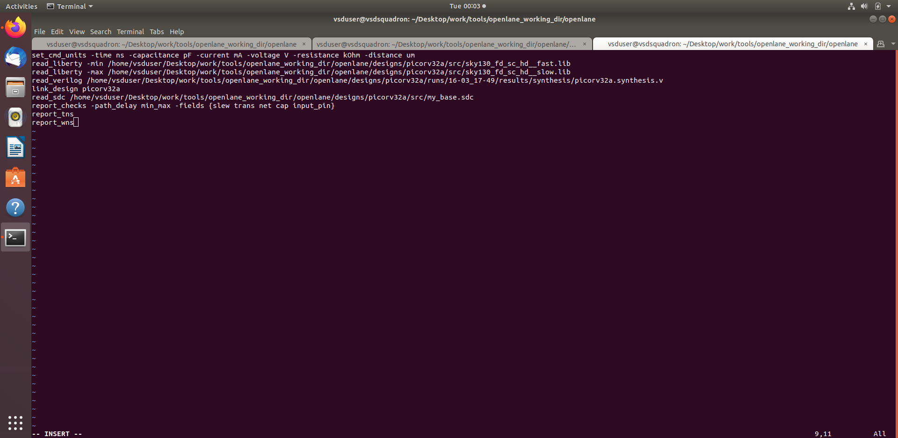

---

## Step 3: Create the SDC File

Path:
```
/home/vsduser/Desktop/work/tools/openlane_working_dir/openlane/designs/picorv32a/src/my_base.sdc
```

```tcl
set ::env(CLOCK_PORT) clk
set ::env(CLOCK_PERIOD) 24.73
set ::env(SYNTH_DRIVING_CELL) sky130_fd_sc_hd__inv_8
set ::env(SYNTH_DRIVING_CELL_PIN) Y
set ::env(SYNTH_CAP_LOAD) 17.65
create_clock [get_ports $::env(CLOCK_PORT)]  -name $::env(CLOCK_PORT)  -period $::env(CLOCK_PERIOD)
set IO_PCT  0.2
set input_delay_value [expr $::env(CLOCK_PERIOD) * $IO_PCT]
set output_delay_value [expr $::env(CLOCK_PERIOD) * $IO_PCT]
puts "\[INFO\]: Setting output delay to: $output_delay_value"
puts "\[INFO\]: Setting input delay to: $input_delay_value"

set clk_indx [lsearch [all_inputs] [get_port $::env(CLOCK_PORT)]]
set all_inputs_wo_clk [lreplace [all_inputs] $clk_indx $clk_indx]
set all_inputs_wo_clk_rst $all_inputs_wo_clk

set_input_delay $input_delay_value  -clock [get_clocks $::env(CLOCK_PORT)] $all_inputs_wo_clk_rst
set_output_delay $output_delay_value  -clock [get_clocks $::env(CLOCK_PORT)] [all_outputs]

set_driving_cell -lib_cell $::env(SYNTH_DRIVING_CELL) -pin $::env(SYNTH_DRIVING_CELL_PIN) [all_inputs]
set cap_load [expr $::env(SYNTH_CAP_LOAD) / 1000.0]
puts "\[INFO\]: Setting load to: $cap_load"
set_load  $cap_load [all_outputs]
```

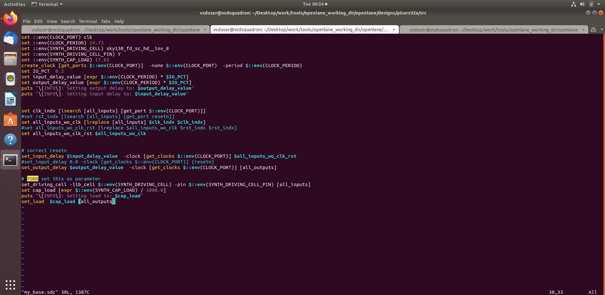

---

## Step 4: Run Timing Analysis using OpenSTA

```bash
sta pre_sta.conf
```

Sample output:

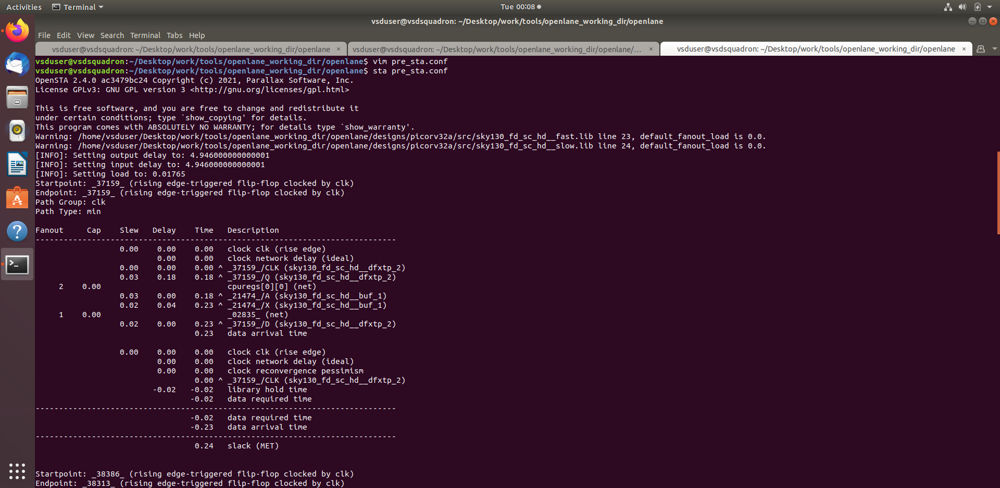 
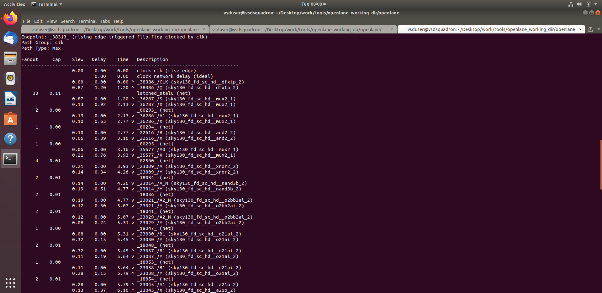 
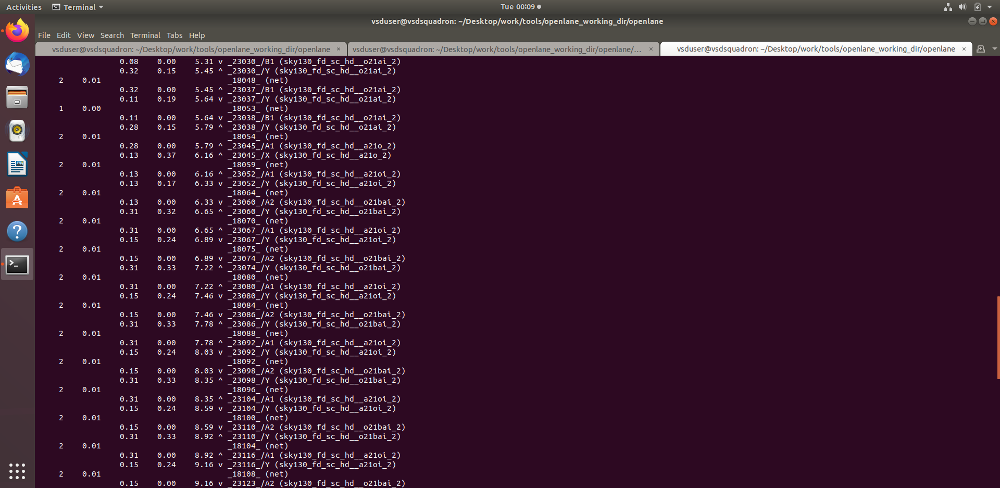
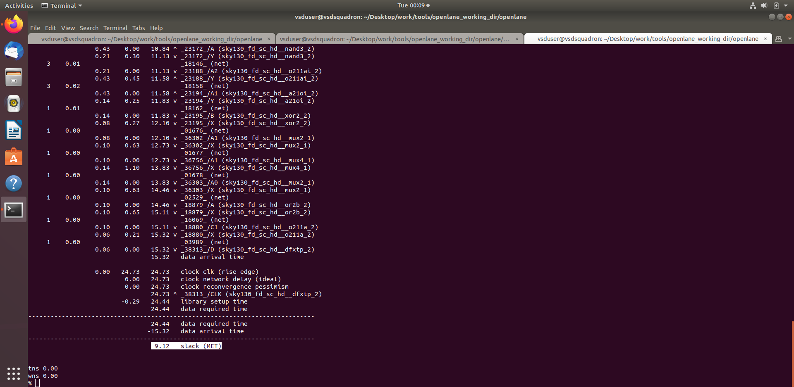
---

## Step 5: Modify Max Fanout and Re-run Synthesis

```bash
./flow.tcl -interactive
package require openlane 0.9
prep -design picorv32a -tag 26-07_06-22 -overwrite
set lefs [glob $::env(DESIGN_DIR)/src/*.lef]
add_lefs -src $lefs
set ::env(SYNTH_SIZING) 1
set ::env(SYNTH_MAX_FANOUT) 4
run_synthesis
```
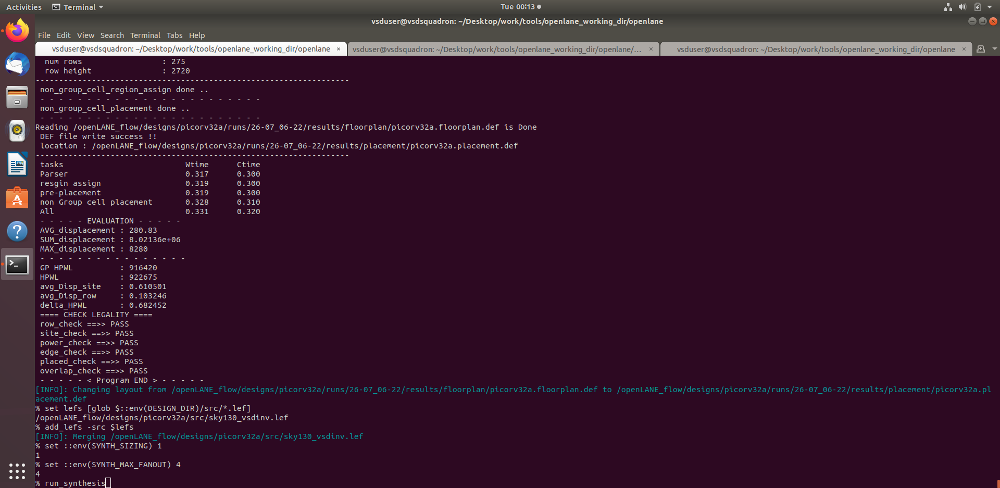

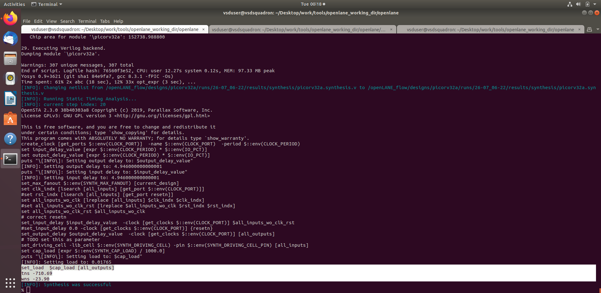

Fanout-modified results:

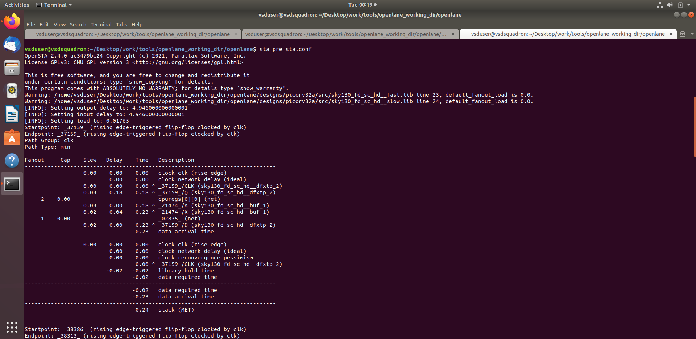 
 
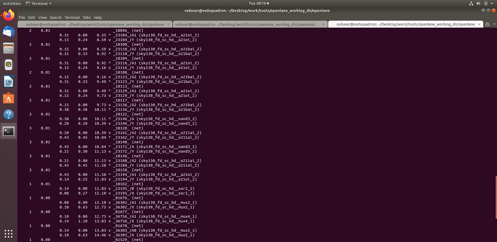 
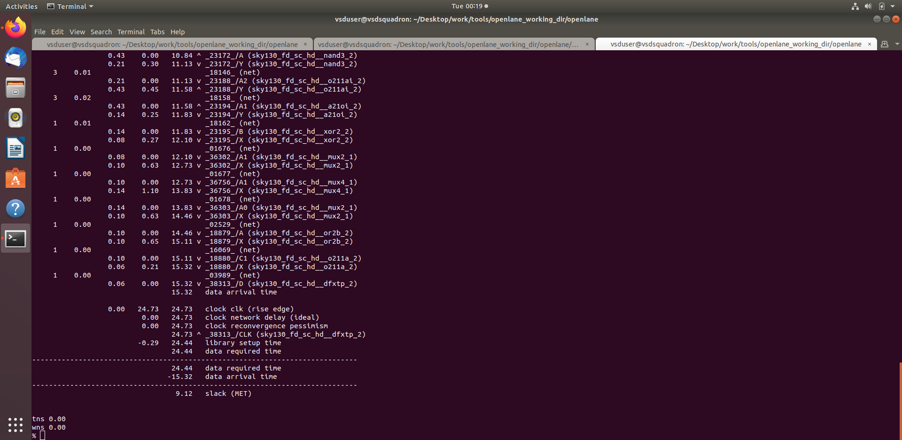 

---

# Clock Tree Synthesis TritonCTS and Signal Integrity


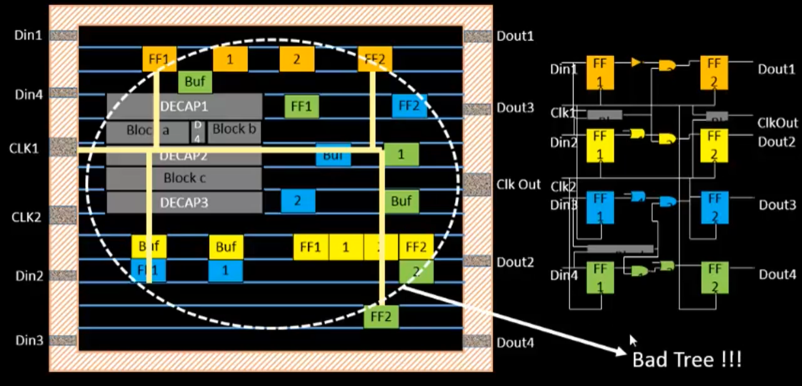

- So we go for `H-Tree` method:

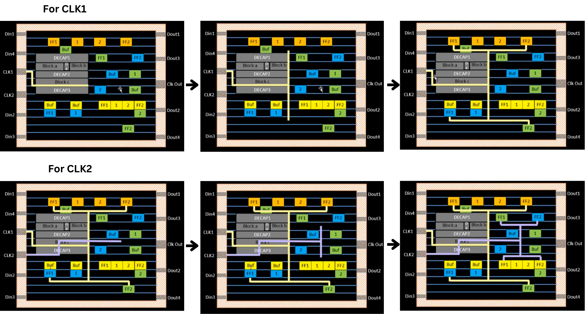


- After adding buffers 

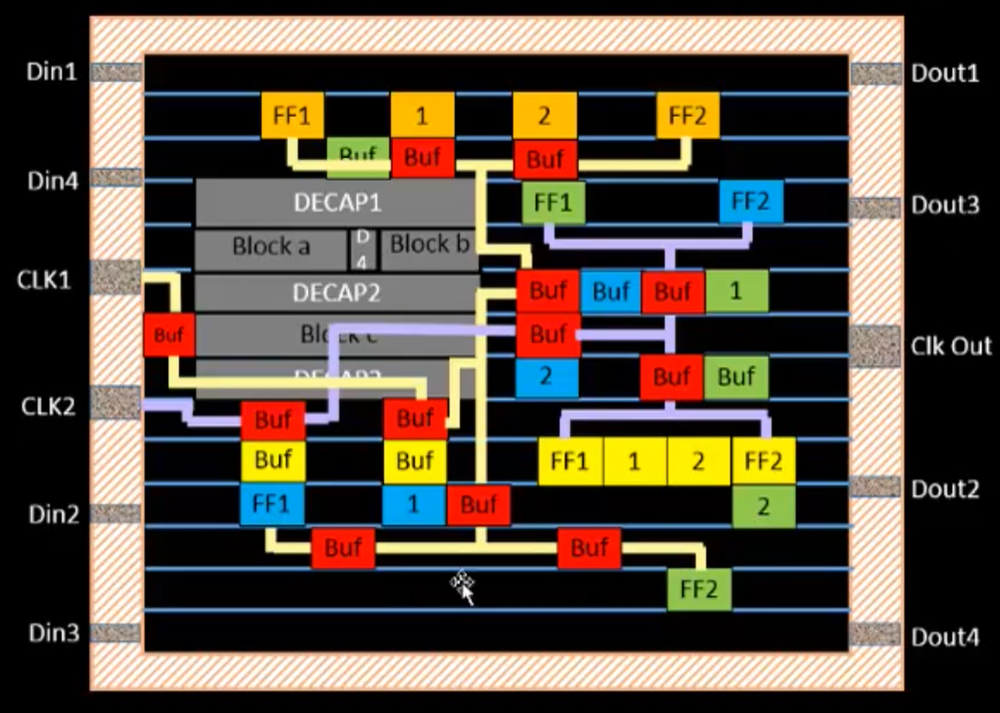

---

### Clock Net Shielding 👇

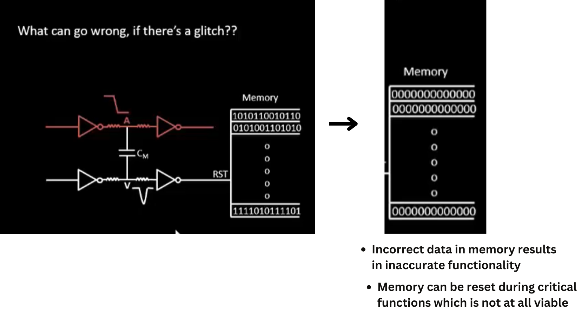


- Therefore, the clock net is shielded:

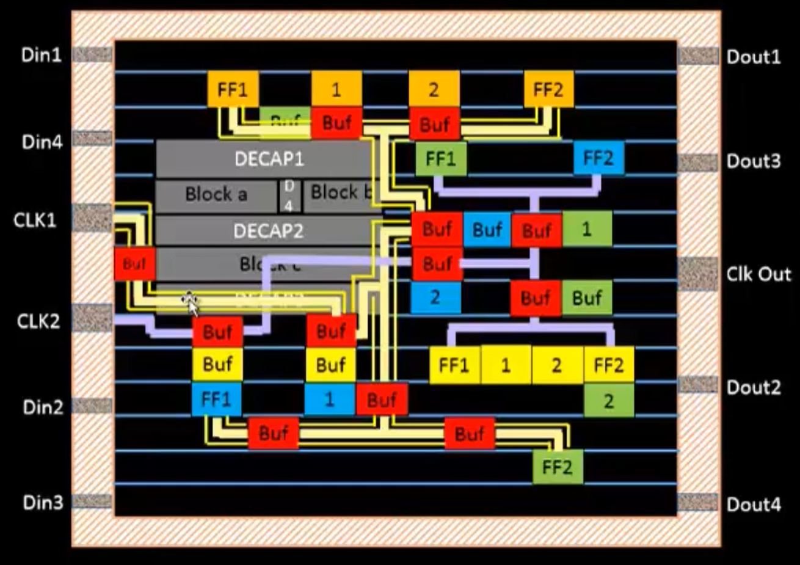

---

### Lab Steps to Run CTS Using TritonCTS

From the previous labs, run until the placement stage using the following commands:

```bash
prep -design picorv32a -tag 16-03_17-49 -overwrite
set lefs [glob $::env(DESIGN_DIR)/src/*.lef]
add_lefs -src $lefs

set ::env(SYNTH_STRATEGY) "DELAY 0"
set ::env(SYNTH_SIZING) 1

run_synthesis

init_floorplan
place_io
global_placement_or
detailed_placement
tap_decap_or
detailed_placement
```

- After placement is done, move to the CTS stage and run:

```bash
run_cts
```

(This uses **TritonCTS** in **OpenROAD**)

---

### CTS Output


---

### Verifying CTS Run


